# Family Board

## Entwicklung einer modernen Webanwendung für die Familie

**Dokumentation zur schulischen Projektarbeit**  
**Do-IT Projekt 2025**  
**Fachinformatiker für Anwendungsentwicklung**

| Feld | Inhalt |
|---|---|
| Verfasser | Timo Giese |
| Gruppe | FIA 2342 00 |
| Abgabedatum | Heidelberg, den 18.04.25 |
| Umschulungsträger | Deutsche Rentenversicherung, Mozart-Straße 3, 68161 Mannheim |
| Schule | SRH GmbH, Bonhoeffer-Straße 1, 69123 Heidelberg |

> Hinweis: Diese Markdown-Version wurde aus der PDF-Dokumentation erstellt. Textinhalte wurden als Markdown strukturiert. Abbildungen, Diagramme, Tabellen und Code-Screenshots aus der PDF sind als Bilddateien im Ordner `assets/` eingebunden.

---

## Inhaltsverzeichnis

- [1 Einleitung](#1-einleitung)
  - [1.1 Informationen zum Umschulungsbetrieb](#11-informationen-zum-umschulungsbetrieb)
  - [1.2 Einsatzgebiet während des Projekts](#12-einsatzgebiet-während-des-projekts)
  - [1.3 Projektziel](#13-projektziel)
  - [1.4 Projektbegründung](#14-projektbegründung)
  - [1.5 Projektschnittstellen](#15-projektschnittstellen)
  - [1.6 Projektabgrenzung](#16-projektabgrenzung)
- [2 Projektplanung](#2-projektplanung)
  - [2.1 Projektphasen](#21-projektphasen)
  - [2.2 Ressourcenplanung](#22-ressourcenplanung)
  - [2.3 Entwicklungsprozess](#23-entwicklungsprozess)
- [3 Analysephase](#3-analysephase)
  - [3.1 Ist-Stand](#31-ist-stand)
  - [3.2 Wirtschaftlichkeitsanalyse](#32-wirtschaftlichkeitsanalyse)
  - [3.3 Anwendungsfälle](#33-anwendungsfälle)
  - [3.4 Make-or-Buy-Entscheidung](#34-make-or-buy-entscheidung)
  - [3.5 Nicht-monetäre Vorteile](#35-nicht-monetäre-vorteile)
- [4 Entwurfsphase](#4-entwurfsphase)
  - [4.1 Softwarearchitektur](#41-softwarearchitektur)
  - [4.2 Datenbankentwurf](#42-datenbankentwurf)
  - [4.3 Entwurf Benutzeroberfläche](#43-entwurf-benutzeroberfläche)
- [5 Implementierungsphase](#5-implementierungsphase)
  - [5.1 Einrichtung der Entwicklungsumgebung](#51-einrichtung-der-entwicklungsumgebung)
  - [5.2 Programmierung](#52-programmierung)
  - [5.2.1 Startseite/Login/Registrierung](#521-startseiteloginregistrierung)
  - [5.2.2 Dashboard](#522-dashboard)
  - [5.2.3 Apps](#523-apps)
  - [5.2.4 Profil/Familienmitglieder/Setup](#524-profilfamilienmitgliedersetup)
- [6 Abnahme und Einführung](#6-abnahme-und-einführung)
- [7 Dokumentation](#7-dokumentation)
- [8 Fazit & Reflexion](#8-fazit--reflexion)
- [9 Ausblick](#9-ausblick)
- [A Anhang](#a-anhang)

---

# 1 Einleitung

Die vorliegende Projektdokumentation beschreibt den Ablauf eines Do-IT-Projekts, das im Rahmen der Umschulung zum Fachinformatiker für Anwendungsentwicklung von Timo Giese durchgeführt wurde. Im Fokus des Projekts steht die Konzeption, Entwicklung und Implementierung einer Anwendung zur digitalen Organisation und Verwaltung von Familienaktivitäten.

Ziel des Projekts ist es, die im Rahmen der Umschulung erworbenen Kenntnisse praxisnah anzuwenden, zu vertiefen und weiterzuentwickeln. Gleichzeitig soll die Umsetzung eine realistische Simulation eines späteren beruflichen Einsatzes im Bereich der Softwareentwicklung ermöglichen.

Die Projektarbeit umfasst sämtliche Phasen des Softwareentwicklungsprozesses - von der Anforderungsanalyse über die technische Konzeption und Umsetzung bis hin zur Dokumentation und abschließenden Präsentation im Rahmen eines Fachgesprächs.

## 1.1 Informationen zum Umschulungsbetrieb

„Die SRH Holding (ehemals Stiftung Rehabilitation Heidelberg) ist eine private Stiftung bürgerlichen Rechts (SdbR) mit Sitz in Heidelberg. Sie weist mit 1,072 Milliarden Euro gemäß dem Bundesverband Deutscher Stiftungen die höchsten Gesamtausgaben aller deutschen Stiftungen privaten Rechts auf.

Die Stiftung ist Dachgesellschaft eines Konzerns aus mehreren Tochterunternehmen, die im Gesundheits-, Bildungs- und Sozialwesen tätig sind. Zur SRH gehören private Hochschulen, allgemeinbildende und berufliche Schulen, Fachschulen, Bildungszentren für Weiterbildung und berufliche Rehabilitation sowie Krankenhäuser und Rehabilitationskliniken.

Die SRH ist Mitglied des Diakonischen Werks der Evangelischen Landeskirche in Baden.“

**Quelle:** https://de.wikipedia.org/wiki/SRH_Holding

## 1.2 Einsatzgebiet während des Projekts

Das Projekt wurde im Zeitraum vom 17.03.2025 bis zum 18.04.2025 durchgeführt. Während der Projektphase war der Schüler überwiegend an der Schule vor Ort tätig, wodurch er wertvolle praktische Erfahrungen sammeln konnte. Ergänzend dazu ermöglichte ihm der zweimalige Einsatz im Home-Office an Freitagen, flexible Arbeitsbedingungen kennenzulernen und eigenverantwortlich an seinen Aufgaben zu arbeiten.

## 1.3 Projektziel

Ziel dieses Projekts ist die Entwicklung einer webbasierten Anwendung, die den Familienalltag strukturiert, vereinfacht und möglichst digital abbildet. Dafür werden im Rahmen des Projekts mehrere Module umgesetzt, die je nach Bedarf genutzt werden können:

- **Familienkalender:** Zur gemeinsamen Terminplanung, inklusive einer Funktion zur Verwaltung fahrzeugbezogener Termine wie Wartungen oder Prüfungen.
- **Bildergalerie:** Ermöglicht das Hochladen, Speichern und Teilen von Fotos - eine einfache Lösung zur Archivierung schöner Familienmomente.
- **Einkaufsliste:** Zur Verwaltung gemeinsamer Besorgungen mit der Möglichkeit, die Liste als PDF-Datei zu exportieren und auszudrucken.
- **To-Do-Liste:** Ein praktisches Tool zur Aufgabenverteilung und -nachverfolgen innerhalb der Familie.
- **Registrierung & Login:** Ein geschützter Zugang sorgt dafür, dass nur berechtigte Nutzer Zugriff auf die Anwendung erhalten.
- **Optional: Chatfunktion:** Falls der Projektzeitraum es zulässt, wird ein einfaches internes Chatsystem integriert.

Die Kombination dieser Module schafft eine praktische und flexible Lösung für den digitalen Familienalltag - übersichtlich, bedarfsgerecht und erweiterbar.

## 1.4 Projektbegründung

Ziel der Anwendung ist es, eine flexible Lösung zur Organisation des Familienalltags zu entwickeln, die sich an den individuellen Bedürfnissen der Nutzer orientiert. Viele bestehende Systeme am Markt bieten ausschließlich Komplettlösungen an - mit festen Funktionspaketen, die nicht angepasst werden können. Das führt oft zu überladenen Anwendungen mit vielen Features, die im Alltag gar nicht gebraucht werden.

Die geplante Anwendung verfolgt deshalb einen anderen Ansatz und setzt auf einen modularen Aufbau mit klaren Vorteilen:

- **Individuelle Modulauswahl:** Die Nutzer können selbst entscheiden, welche Funktionen sie nutzen möchten - zum Beispiel einen Kalender mit Fahrzeugverwaltung, eine Bildergalerie, eine Einkaufsliste mit PDF-Export oder zusätzliche Tools wie To-Do-Listen und Chatfunktionen. So entsteht genau das System, das sie wirklich brauchen - ohne unnötigen Ballast.
- **Leichte Erweiterbarkeit:** Durch die saubere Trennung der Module lassen sich neue Funktionen problemlos ergänzen, ohne bestehende Komponenten anfassen zu müssen. So bleibt die Anwendung flexibel und kann mit den Anforderungen der Nutzer wachsen.
- **Einfache Wartung und Fehlerbehebung:** Da jedes Modul für sich entwickelt, getestet und gewartet wird, bleibt die Gesamtanwendung übersichtlich. Das erleichtert sowohl die Entwicklung als auch spätere Updates und Anpassungen.

Mit diesem modularen Ansatz entsteht eine benutzerfreundliche, anpassbare und zukunftssichere Lösung, die sich bewusst von starren Komplettsystemen abhebt. Der Fokus liegt klar auf dem, was für die Nutzer wirklich relevant ist - heute und auch morgen.

## 1.5 Projektschnittstellen

Bei der Entwicklung der Website kamen verschiedene externe Bibliotheken, Schnittstellen und Tools zum Einsatz. Sie erweitern die Funktionalität der Anwendung und ermöglichen eine effiziente technische Umsetzung:

- **Datenbankanbindung (MySQL/PDO):** Die zentrale Datenspeicherung läuft über eine MySQL-Datenbank. Der Zugriff erfolgt mithilfe von PHP Data Objects (PDO), was eine sichere und flexible Verbindung zwischen der Anwendung und der Datenbank ermöglicht.
- **FullCalendar:** Für das Modul Familienkalender wird die JavaScript-Bibliothek FullCalendar verwendet. Sie bietet eine moderne und interaktive Oberfläche zur Terminverwaltung - inklusive Drag & Drop, Tages-, Wochen- und Monatsansicht sowie direkter Bearbeitung im Browser.
- **PDF-Generierung (FPDF):** Um die Einkaufsliste auch offline nutzen zu können, wurde eine Exportfunktion integriert. Mit Hilfe der PHP-Bibliothek FPDF wird eine übersichtliche PDF-Datei erstellt, die nach Einkaufskategorien sortiert ist und sich bequem ausdrucken lässt.
- **E-Mail-Kommunikation (PHPMailer, Mailtrap, Composer):** Für die Registrierung und den Versand von Bestätigungs-E-Mails kommt PHPMailer zum Einsatz. Die Einbindung erfolgt über Composer, was die Verwaltung von Abhängigkeiten vereinfacht. In der Entwicklungsumgebung wird Mailtrap genutzt, um den E-Mail-Versand realistisch zu testen - ohne dabei echte E-Mails zu verschicken.

Diese Schnittstellen sorgen dafür, dass die Anwendung nicht nur funktional und modular aufgebaut ist, sondern auch eine gute Basis für mögliche Erweiterungen in der Zukunft bietet.

**Abbildung 1: Schnittstellen**

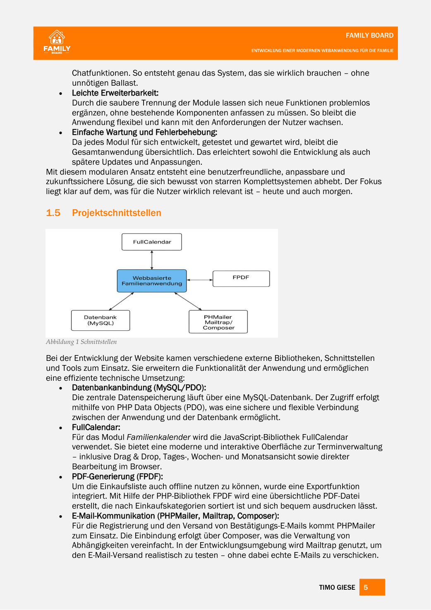

## 1.6 Projektabgrenzung

Die Webanwendung wurde hauptsächlich für den privaten Gebrauch innerhalb der Familie entwickelt und läuft lokal - also nicht im Internet. Ein dauerhafter Onlinebetrieb war nicht Teil des Projekts.

Deshalb wurden Themen wie öffentliches Hosting, Sicherheitsfunktionen auf Produktivniveau (wie HTTPS, Zwei-Faktor-Authentifizierung) oder die Verwaltung vieler Nutzer außerhalb der Familie nicht berücksichtigt. Der Fokus lag stattdessen darauf, dass die Anwendung im privaten Rahmen gut funktioniert, übersichtlich aufgebaut ist und sich einfach bedienen lässt.

---

# 2 Projektplanung

## 2.1 Projektphasen

Für die Umsetzung des Projekts standen dem Projektverantwortlichen insgesamt 160 Stunden zur Verfügung. Diese Zeit wurde schon zu Beginn auf die typischen Phasen der Softwareentwicklung verteilt: Analyse, Entwurf, Umsetzung, Abnahme & Einführung sowie Dokumentation.

Die einzelnen Phasen lehnen sich an den realen Ablauf eines Entwicklungsprojekts an und wurden in konkrete Aufgaben aufgeteilt. So konnte sichergestellt werden, dass sowohl technische als auch organisatorische Anforderungen strukturiert und effizient bearbeitet wurden. Eine genaue Übersicht über die Aufgaben und die dazugehörige Zeitplanung ist im Anhang A.1 zu finden.

Bei der Zeiteinteilung lag der Fokus klar auf der Umsetzung der Module - zum Beispiel dem Login-System, dem Familienkalender oder der Einkaufsliste. Aber auch für das Testen und die Dokumentation wurde ausreichend Zeit eingeplant, um ein qualitativ hochwertiges und gut nachvollziehbares Ergebnis zu erzielen.

## 2.2 Ressourcenplanung

Für die erfolgreiche Umsetzung des Projekts wurden verschiedene Ressourcen benötigt, die in der Übersicht im Anhang A.2: Verwendete Ressourcen aufgeführt sind. Dabei handelt es sich sowohl um Hard- als auch Softwarekomponenten, sowie um personelle Ressourcen.

### Hardware

Für die Entwicklung und Testen der Anwendung wurde der Leihlaptop der Schule benutzt.

### Software

Bei der Auswahl der Software wurde darauf geachtet, dass diese entweder Open-Source ist oder kostenfrei verwendet werden kann, um zusätzliche Projektkosten zu vermeiden:

- XAMPP - zur lokalen Ausführung des Webservers inkl. MySQL
- VS Code - als Entwicklungsumgebung
- PHP, JavaScript, HTML/CSS - zur Umsetzung der Anwendung
- phpMyAdmin - zur Verwaltung der Datenbank
- Composer - zur Verwaltung von PHP-Abhängigkeiten
- PHPMailer - für die Registrierungsfunktion mit E-Mail-Bestätigung
- Mailtrap - als Mail-Testumgebung
- FPDF - zur Generierung von PDFs (Einkaufslisten)
- FullCalendar.js - zur Integration des Familienkalenders
- GitHub - zur Versionskontrolle

### Personelle Ressourcen

Das Projekt wurde eigenständig von dem Projektverfasser umgesetzt. Ein externer „Kunde“ wurde zur Evaluation und Feedbackzwecken eingebunden (z. B. im Rahmen der Abnahmephase), spielte aber keine aktive Rolle in der Entwicklung selbst.

## 2.3 Entwicklungsprozess

Im Rahmen des Projekts wurde keine feste agile Methodik angewendet, aber es gab regelmäßige Feedbackgespräche mit dem „Kunden“ sowie dem betreuenden Dozenten. Die Projektarbeit war zwar nicht streng strukturiert, jedoch wurden verschiedene Phasen durchlaufen, die jeweils konkrete Ziele und Aufgaben beinhalteten. Der zeitliche Ablauf wurde mithilfe eines GANTT-Diagramms (Anhang A.3) visualisiert, was eine gewisse Planung und Überwachung der Fortschritte ermöglichte.

---

# 3 Analysephase

## 3.1 Ist-Stand

Der Familienalltag wird bereits durch verschiedene digitale Lösungen wie Kalender-Apps, To-Do-Listen und Einkaufslisten organisiert. Diese sind jedoch oft auf einzelne Funktionen beschränkt, erfordern mehrere Apps oder unterstützen keine familiäre Mehrbenutzerstruktur. Zudem fehlt es an einer zentralen Übersicht und an Anpassungsmöglichkeiten der Oberfläche. Viele bestehende Lösungen sind kostenpflichtig oder bieten keine Möglichkeit, die Funktionen nach den individuellen Bedürfnissen der Nutzer auszuwählen. Aus diesen Gründen entstand die Idee, eine webbasierte Anwendung zu entwickeln, die verschiedene organisatorische Funktionen für den Familienalltag in einem lokal betriebenen System vereint.

## 3.2 Wirtschaftlichkeitsanalyse

Da es sich um ein Schulprojekt handelt, fielen keine echten Kosten an. Für eine realistische Einschätzung wurde jedoch eine fiktive Kalkulation erstellt. Auf Basis eines Bruttostundenlohns von 27 € und 160 Stunden Entwicklungszeit ergeben sich Personalkosten von ca. 4.320 €. Hinzu kommen geschätzte Hardwarekosten von 1.320 € sowie Softwarekosten in Höhe von 438 € bei Nutzung kommerzieller Alternativen. Insgesamt würde das Projekt rund 6.078 € kosten. Der größte Kostenfaktor ist die Arbeitszeit. Die Wirtschaftlichkeit hängt daher stark vom potenziellen Nutzen oder einer Weitervermarktung ab. Gemeinkosten sowie Aufwand für Wartung und Support wurden nicht berücksichtigt.

### Fiktive Kalkulation

| Position | Wert |
|---|---:|
| Bruttostundenlohn | 27 € |
| Entwicklungszeit | 160 Stunden |
| Personalkosten | 27 € × 160 Stunden = 4.320 € |
| Hardwarekosten | 1.320 € |
| Softwarekosten bei Nutzung kommerzieller Alternativen | 438 € |
| **Gesamtkosten** | **6.078 €** |

## 3.3 Anwendungsfälle

Um einen Überblick über die geplanten Anwendungsfälle der Anwendung zu bekommen, wurde in der Analysephase ein Use-Case-Diagramm erstellt. Dieses Diagramm, das im Anhang A.4 zu finden ist, zeigt alle Funktionen, die aus Sicht der Endnutzer wichtig sind.

## 3.4 Make-or-Buy-Entscheidung

Die Entscheidung für eine eigene Anwendung basierte auf einer fiktiven Abwägung von Kosten und Nutzen, da es sich um ein Schulprojekt handelt. Viele fertige Lösungen sind teuer oder bieten nicht genau die gewünschten Funktionen. Auch wenn eine Eigenentwicklung mehr Zeit kostet, zeigt die Wirtschaftlichkeitsanalyse, dass sie bei klaren Anforderungen und vorhandenem Know-how langfristig günstiger und flexibler sein kann.

## 3.5 Nicht-monetäre Vorteile

Neben den finanziellen Aspekten brachte das Projekt auch mehrere nicht-monetäre Vorteile. Besonders wertvoll war der persönliche Lerneffekt, der durch die eigenständige Planung, Umsetzung und Problemlösung in allen Projektphasen entstand. Die intensive Arbeit mit Webtechnologien, Benutzerführung, Datenspeicherung und Datenschutz hat nicht nur mein fachliches Wissen erweitert, sondern auch mein Verständnis für die gesamte Softwareentwicklung vertieft.

Außerdem ermöglicht die selbst entwickelte Anwendung eine größere Identifikation mit dem Produkt und die Freiheit, Funktionen und Design nach Bedarf anzupassen - ein Vorteil, den viele Standardlösungen nicht bieten.

---

# 4 Entwurfsphase

Nachfolgend soll erläutert werden, wie die Anwendung aufgebaut sein soll. Skizzen des Layouts und Designs sind in den Anhängen A.5 bis A.7 aufgeführt.

## 4.1 Softwarearchitektur

Die Anwendung ist in verschiedene Bereiche unterteilt, die jeweils eine bestimmte Aufgabe erfüllen, wie zum Beispiel die Benutzerverwaltung, die einzelnen Apps (wie Kalender oder To-Do-Liste), die Konfiguration und das Design. Diese klare Aufteilung sorgt dafür, dass das Projekt übersichtlich bleibt und spätere Änderungen oder Erweiterungen einfacher umgesetzt werden können. Die Struktur der Anwendung wird in der `struktur.txt` beschrieben, die als Leitfaden für die Organisation dient. Dabei sind Aufgaben wie die Datenverarbeitung, die Benutzeroberfläche und der Datenbankzugriff in separaten Dateien untergebracht.

Die Benutzeroberfläche besteht aus HTML, SCSS und JavaScript. Wenn der Nutzer eine Aktion ausführt, etwa einen Eintrag hinzufügt oder löscht, wird im Hintergrund eine PHP-Datei über AJAX-Anfragen aufgerufen, ohne dass die gesamte Seite neu geladen werden muss.

Zum Schutz sensibler Dateien wird eine `.htaccess`-Datei verwendet. Sie sorgt dafür, dass niemand direkt auf die PHP-Dateien im privaten Bereich zugreifen kann. Nur bestimmte Skripte, die für wichtige Funktionen oder AJAX-Anfragen erforderlich sind, sind freigegeben. Das schützt die Anwendung und den Server vor unbefugtem Zugriff.

## 4.2 Datenbankentwurf

Um alle Anwendungsdaten strukturiert und konsistent zu verwalten, wurde eine relationale Datenbank mit MySQL erstellt. Die Datenbank speichert wichtige Entitäten wie Familien, Benutzer, Apps, Einkaufslisten, Kalendereinträge, ToDos und Bilder. Diese Entitäten sind miteinander verbunden, zum Beispiel über Fremdschlüssel oder spezielle Zuordnungstabellen (wie UserApps, UserToDo, UserItems). Das sorgt dafür, dass Daten schnell und eindeutig abgerufen und zugeordnet werden können.

Das Datenbankschema ist so gestaltet, dass eine Familie mehrere Benutzer haben kann. Jeder Benutzer kann eigene Apps, ToDo-Listen, Kalendereinträge oder Bilder verwalten. Zusätzlich speichert die Benutzerverwaltung weitere Informationen wie Profilbilder oder Social-Media-Links.

Für die Einladung neuer Mitglieder gibt es eine spezielle Tabelle (`Invites`), die eine Registrierung über E-Mail mit einem Token ermöglicht. Einkaufslisten sind zudem in spezifische Shops und Artikel unterteilt.

Eine grafische Darstellung des gesamten Datenbankmodells befindet sich im Anhang A.8: ER-Diagramm.

## 4.3 Entwurf Benutzeroberfläche

Die Benutzeroberfläche ist modular aufgebaut und in verschiedene Funktionsbereiche unterteilt, die sich visuell voneinander abheben. Ein zentrales Dashboard dient als Einstiegspunkt und bietet einen schnellen Überblick über alle wichtigen Funktionen, wie Kalender, To-Do-Listen, Einkaufslisten oder Familiennachrichten. Icons, Farben und Layouts sind so gewählt, dass sie die Orientierung innerhalb der Anwendung erleichtern und die Wiedererkennung bestimmter Funktionen fördern.

Interaktive Elemente wie Buttons, Formulare oder Popups wurden einheitlich gestaltet, um eine konsistente Benutzererfahrung zu gewährleisten. Die Bedienung erfolgt weitgehend dynamisch - viele Inhalte werden mittels AJAX geladen, wodurch Seitenwechsel reduziert und Reaktionszeiten verbessert werden.

Die in den Anhängen A.5 bis A.7 dargestellten Layoutskizzen visualisieren zentrale Ansichten der Anwendung, darunter das Dashboard, die Navigation sowie exemplarische App-Bereiche wie die To-Do-Liste oder den Kalender.

---

# 5 Implementierungsphase

Die Umsetzung des Projektes wird in folgenden Kapiteln beschrieben.

## 5.1 Einrichtung der Entwicklungsumgebung

Für die Umsetzung des Projekts wurde ein schulischer Laptop verwendet, der bereits alle notwendigen Webentwicklungstools beinhaltete. Die Entwicklungsumgebung bestand aus:

- Visual Studio Code als Haupteditor für PHP, HTML, JavaScript und SCSS.
- XAMPP für die lokale Bereitstellung eines Apache-Webservers und einer MySQL-Datenbank.
- DBeaver zur Verwaltung der MySQL-Datenbank.
- Koala zur automatischen Kompilierung der SCSS-Dateien.

Dank dieser Umgebung konnte direkt mit der Entwicklung begonnen werden, ohne weitere Installationen oder Konfigurationen.

## 5.2 Programmierung

Die Programmierung der Anwendung erfolgte schrittweise, beginnend mit den grundlegenden Funktionen wie Login und Registrierung bis hin zur Implementierung der verschiedenen Apps und der Benutzerverwaltung.

## 5.2.1 Startseite/Login/Registrierung

### `index.php`

Stellt die zentrale Einstiegsseite dar. Enthält HTML, PHP und JavaScript.

Funktionen:

- Anzeige von Login- und Registrierungsoptionen
- Visuelles Feedback, z. B. bei erfolgreicher Registrierung
- JavaScript für animiertes Einblenden von Elementen (Anhang A.9)
- Formular Versand via POST an `auth.php`
- Login-Button löst JavaScript-Funktion aus, nicht klassisches Submit

**Abbildung 2: Login-Formular**

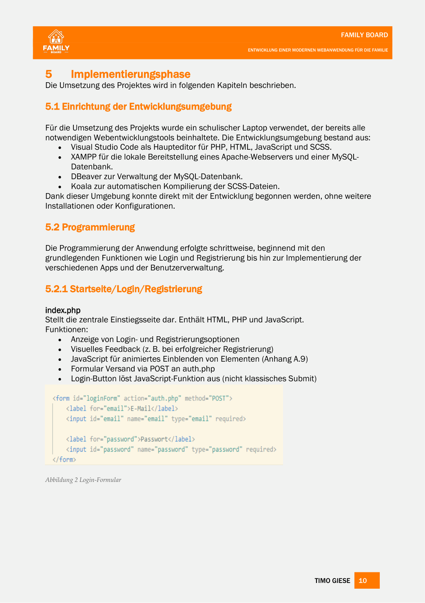

**Abbildung 3: JavaScript für FormularSubmit**

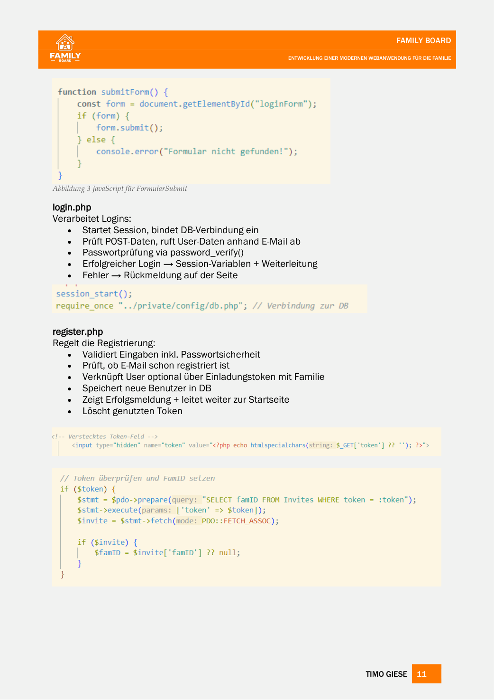

### `login.php`

Verarbeitet Logins:

- Startet Session, bindet DB-Verbindung ein
- Prüft POST-Daten, ruft User-Daten anhand E-Mail ab
- Passwortprüfung via `password_verify()`
- Erfolgreicher Login → Session-Variablen + Weiterleitung
- Fehler → Rückmeldung auf der Seite

### `register.php`

Regelt die Registrierung:

- Validiert Eingaben inkl. Passwortsicherheit
- Prüft, ob E-Mail schon registriert ist
- Verknüpft User optional über Einladungstoken mit Familie
- Speichert neue Benutzer in DB
- Zeigt Erfolgsmeldung + leitet weiter zur Startseite
- Löscht genutzten Token

## 5.2.2 Dashboard

### `dashboard.php`

Zentrale Übersichtsseite nach dem Login.

Funktionen:

- Anzeige von Apps (To-Do, Kalender, Einkaufsliste) als Widgets
- Verwaltung von Familie (erstellen, Mitglieder einladen)
- Modular erweiterbar durch App-Auswahl im modalen Fenster
- Zugriff nur mit aktiver Session (`session_start()` + Prüfung)

### App-Verwaltung

- Apps werden per `fetch()` (z. B. `add_user_app.php`) dynamisch hinzugefügt/entfernt
- Auswahl wird in der Datenbank gespeichert
- Änderungen erscheinen ohne Neuladen direkt im Dashboard
- Siehe Code in Anlage A.10-A.12

### Einladungsfunktion mit PHPMailer

- Beim Absenden des Einladungsformulars wird ein eindeutiger Registrierungstoken erzeugt und gespeichert
- PHPMailer sendet eine Einladung per E-Mail über Mailtrap
- Der SMTP-Zugang ist in der Datei konfiguriert, E-Mails sind über das Mailtrap-Dashboard einsehbar
- So wird echter Versand im Testbetrieb vermieden

Hinweis: Code für Header, Navigation und Widgets wird in dieser Dokumentation nicht behandelt.

**Codeausschnitt Dashboard / PHPMailer aus der PDF**

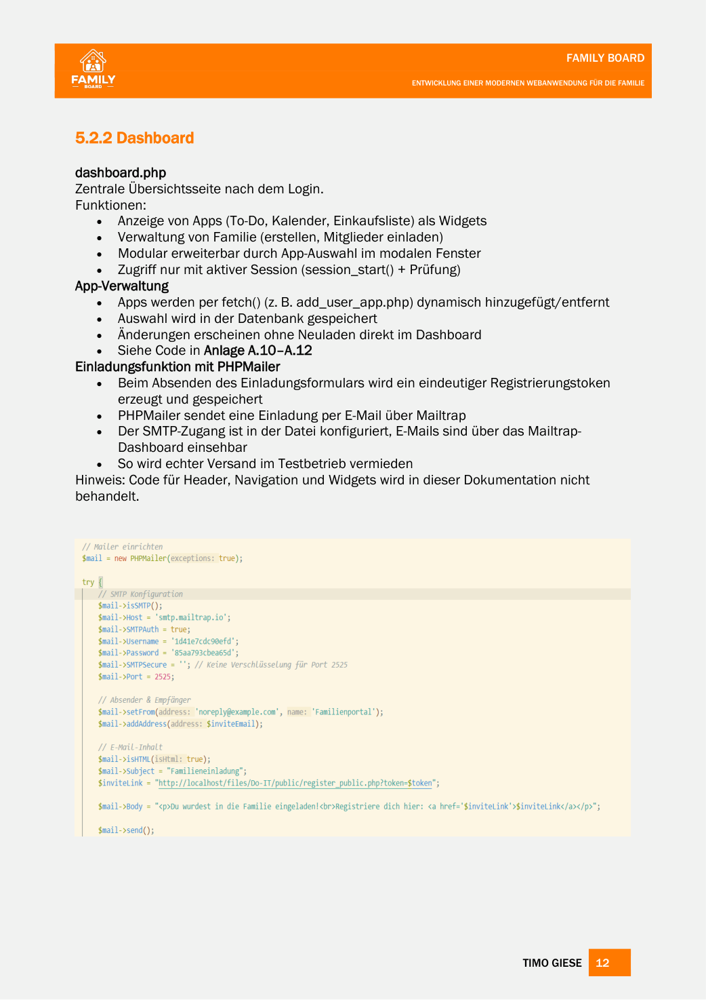

## 5.2.3 Apps

### `calender.php`

Die Kalender-App ermöglicht es Nutzern, Ereignisse für die Familie zu verwalten. Die Anzeige und Interaktion erfolgt über das JavaScript-Plugin FullCalendar, das serverseitig über eine PHP-Schnittstelle (`events.php`) mit Daten aus der Datenbank versorgt wird.

Hauptfunktionen:

- Anzeige aller Events im Monats-, Wochen- oder Tagesraster.
- Erstellung, Bearbeitung und Löschung von Terminen via Modal.
- Farbige Kategorisierung von Terminen (Arbeit, Familie, Freizeit, Sonstiges).
- Optional kann das Familienauto per Checkbox reserviert werden (`carReserved`).

Datenübertragung:

- Beim Hinzufügen, Bearbeiten oder Löschen eines Events wird per `fetch()` ein JSON-Objekt an `events.php` übermittelt (POST, PUT oder DELETE).
- Beispiel für das Erstellen eines Termins (Anlage A.13).

### `gallery.php`

Die Galerie-App ermöglicht den Upload und die Anzeige von Familienbildern, die in der Datenbank als BLOB (Binary Large Object) gespeichert werden. Anstatt die Bilddateien als separate Dateien abzulegen, werden sie direkt in der Datenbank abgelegt. Beim Abruf der Bilder wird das gespeicherte Binärformat mit `base64_encode()` in einen Base64-codierten String umgewandelt, der im `src`-Attribut eines ``-Tags eingebunden wird.

**Gallerie erzeugen:** Für jedes `$bild` entsteht ein `
`-Block, der das Bild selbst und das zugehörige Formular für das Löschen enthält.

### `shoppingList.php`

Die Einkaufsliste ermöglicht es den Nutzern, Artikel für die Familie hinzuzufügen und zu verwalten. Die wichtigsten Punkte sind:

**Artikel hinzufügen:** Das Formular nimmt Artikelname, Menge und den zugehörigen Shop (z. B. Aldi, Lidl, Rewe) als Eingaben entgegen.

Zur Speicherung der Artikel wird zunächst ein SQL-Befehl ausgeführt, der mittels `INSERT ... ON DUPLICATE KEY UPDATE` sicherstellt, dass, falls ein Artikel bereits existiert, dessen Menge erhöht wird.

Artikel löschen mit JavaScript.

Eine wesentliche Funktion ist die Ausgabe der Liste als PDF durch die PHP Bibliothek FPDF (Anhang A.14).

**Codeausschnitt Galerie / Apps aus der PDF**

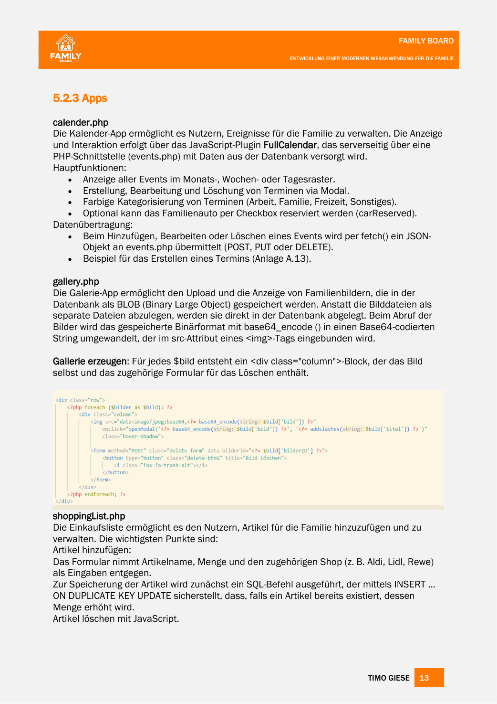

### `toDoList.php`

Die ToDo-Liste bietet eine einfache Aufgabenverwaltung für den Familienalltag.

Über ein Formular wird eine neue Aufgabe an die Datei `add_todo.php` gesendet und in der Datenbank gespeichert. Darunter werden alle vorhandenen Aufgaben mit einer PHP-Schleife aufgelistet. Zu jeder Aufgabe wird der Titel, der Ersteller und eine Checkbox angezeigt.

Mit der Funktion `toggleTask()` kann eine Aufgabe als erledigt markiert oder wieder zurückgesetzt werden. Dies geschieht per Aufruf einer separaten Datei, die den Status in der Datenbank aktualisiert. Über einen kleinen `×`-Link kann die Aufgabe außerdem gelöscht werden. Siehe Anhang A.15.

Aufgaben sind über eine Zwischentabelle `UserToDo` einem bestimmten Nutzer zugeordnet. Das verhindert das Familienmitglieder die Aufgaben anderer Familienmitglieder löschen können.

## 5.2.4 Profil/Familienmitglieder/Setup

Da diese Elemente nicht Bestandteil des offiziellen Projektantrags sind, werden sie in der Dokumentation nicht weiter behandelt.

---

# 6 Abnahme und Einführung

Die Abnahme erfolgte nicht gebündelt am Ende der Projektlaufzeit, sondern begleitete den Entwicklungsprozess fortlaufend. In regelmäßigen Gesprächen mit den betreuenden Fachdozenten wurden einzelne Funktionseinheiten vorgestellt, besprochen und angepasst.

Eine abschließende Vorstellung der fertigen Anwendung erfolgte kurz vor Projektende im direkten Austausch mit dem Auftraggeber. Dabei wurden die Kernfunktionen demonstriert und das Gesamtsystem bewertet.

Auch die Tests wurden nicht ausschließlich am Projektende durchgeführt, sondern fanden modulweise direkt nach Fertigstellung einzelner Bestandteile statt. Dieses Vorgehen ermöglichte eine kontinuierliche Optimierung und frühzeitige Fehlerbehebung im Entwicklungsprozess.

---

# 7 Dokumentation

Die Dokumentation gliedert sich in mehrere Bestandteile. Zum einen umfasst sie die Projektdokumentation, in der Planung, Umsetzung und technische Details des Systems festgehalten sind. Ergänzend dazu wurde ein Benutzerhandbuch erstellt, das die Nutzung der Anwendung aus Anwendersicht erläutert. Dieses befindet sich im hier:

`Bedienungsanleitung.docx`

Zusätzlich steht eine separate README-Datei zur Verfügung, die Schritt für Schritt die Installation und Einrichtung des Systems beschreibt und insbesondere für die Testumgebung relevant ist.

---

# 8 Fazit & Reflexion

Das Projekt war insgesamt in Bezug auf Komplexität und Umfang eine große Herausforderung, da die notwendigen Vorkenntnisse nicht ausreichend vorhanden waren. Sehr früh wurde mir bewusst das die Chat-Funktion nicht eingebaut wird.

Trotz vieler Schwierigkeiten konnten viele Ziele erreicht werden, auch wenn nicht alle Erwartungen vollständig erfüllt wurden. Die Responsivität war ein wichtiger Aspekt des Projekts, insbesondere da ich sicherstellen wollte, dass die Anwendung auf mobilen Geräten einwandfrei funktioniert. Allerdings war dies nicht das zentrale Ziel, sondern eher eine notwendige Anforderung, um die Nutzererfahrung zu optimieren, leider hat das am Ende nicht funktioniert bzw. die Zeit hat gefehlt. Dennoch war der Lernprozess sehr intensiv und wertvoll. Ohne die Unterstützung der KI wäre es wahrscheinlich nicht möglich gewesen, das Projekt in der geplanten Funktionalität fertigzustellen. Dabei habe ich jedoch nicht nur Lösungen kopiert, sondern versucht, gemeinsam mit der KI an Lösungen zu arbeiten. Dieser Prozess war äußerst lehrreich. Durch die Komplexität des Projekts und die Vielzahl neuer Themen, die ich berücksichtigen musste, verlor ich mit der Zeit etwas den Überblick.

Leider hat die Dokumentation nicht so funktioniert, wie ich es mir ursprünglich vorgenommen hatte. Mein Plan war es, nach jedem Arbeitstag festzuhalten, was ich erreicht habe, und am Ende der Woche eine umfassende Zusammenfassung zu schreiben. Doch oft war ich so in die technischen Herausforderungen vertieft, dass das Dokumentieren immer wieder in den Hintergrund trat. Jetzt, bei der tatsächlichen Erstellung der Dokumentation, bereitet mir diese Lücke große Schwierigkeiten.

Trotz der Herausforderungen und unerfüllten Erwartungen habe ich wertvolle Erfahrungen gesammelt, die mir bei zukünftigen Projekten sicher weiterhelfen werden.

---

# 9 Ausblick

Für die Zukunft könnte es sinnvoll sein, die App weiter zu optimieren, insbesondere in Bezug auf die Benutzeroberfläche und die Responsivität. Es wäre möglich, die Anwendung noch weiter auf unterschiedliche Geräte und Bildschirmgrößen abzustimmen, um die Nutzererfahrung zu verbessern.

Ein weiterer Entwicklungsschritt könnte die Integration von Minispielen sein, die den Nutzern helfen, sich stärker mit der App zu beschäftigen und ihre Funktionen auf unterhaltsame Weise zu nutzen.

Zudem könnte eine erweiterte Personalisierung der App für eine noch individuellere Nutzererfahrung sorgen. Hierbei könnten Nutzer Einstellungen wie Farben, einen Dark Mode oder auch Spracheinstellungen nach ihren Vorlieben anpassen, was das Benutzererlebnis weiter verbessern würde.

---

# A Anhang

## A.1 Detaillierte Zeitplanung

| Phase | Aufgabe | Zeitaufwand |
|---|---|---:|
| 1. Analysephase | 1.1 Erstellung des Projektplans | 4 Stunden |
| 1. Analysephase | 1.2 Recherche und Planung der Funktionen und Architektur | 11 Stunden |
| 1. Analysephase | 1.3 Vorbereitung und Beschaffung der erforderlichen Tools und Software | 4 Stunden |
| 2. Entwurfsphase | 2.1 Erstellung des Layouts und Designs | 13 Stunden |
| 2. Entwurfsphase | 2.2 Planung der Datenbankstruktur und Sicherheitsmaßnahmen | 6 Stunden |
| 2. Entwurfsphase | 2.3 Detaillierte Funktionsplanung und Strukturierung der Anwendung | 12 Stunden |
| 3. Implementierungsphase | 3.1 Entwicklung des Login-Systems | 10 Stunden |
| 3. Implementierungsphase | 3.2 Aufbau des Familienkalenders | 15 Stunden |
| 3. Implementierungsphase | 3.3 Entwicklung der Bildergalerie | 15 Stunden |
| 3. Implementierungsphase | 3.4 Erstellung der Einkaufsliste und To-Do-Liste | 15 Stunden |
| 3. Implementierungsphase | 3.5 Softwareerweiterungen und Datenbankzugriff | 10 Stunden |
| 4. Abnahme und Einführung | 4.1 Feedbackrunde mit „Kunde“ | 1 Stunde |
| 4. Abnahme und Einführung | 4.2 Durchführen von abschließenden Tests | 4 Stunden |
| 4. Abnahme und Einführung | 4.3 Fehlerbehebung und Anpassungen | 8 Stunden |
| 5. Dokumentationsphase | 5.1 Erstellung der Projektdokumentation | 16 Stunden |
| 5. Dokumentationsphase | 5.2 Erstellung von Wochenberichten | 8 Stunden |
| 5. Dokumentationsphase | 5.3 Vorbereitung und Erstellung der Präsentation | 8 Stunden |
| **Gesamtstundenanzahl** |  | **160 Stunden** |

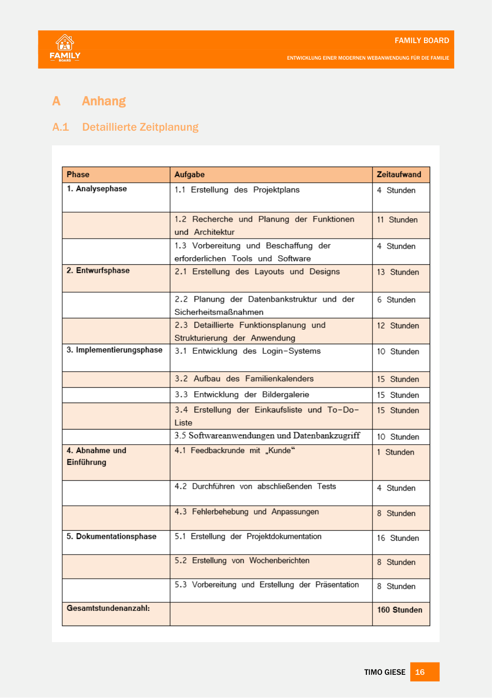

## A.2 Verwendete Ressourcen

| Kategorie | Bezeichnung | Einsatzbereich | Lizenz / Kosten |
|---|---|---|---|
| Hardware | Arbeitsplatzrechner (Windows 11, 16 GB RAM) | Entwicklung, Test, Dokumentation | Bereits vorhanden |
| Software | Visual Studio Code | Quellcode-Editor | Kostenlos |
| Software | XAMPP | Lokaler Webserver + MySQL | Kostenlos |
| Software | phpMyAdmin | Datenbankverwaltung | Kostenlos |
| Software | PHP / HTML / CSS / JavaScript | Programmiersprachen für die Webentwicklung | Kostenlos |
| Software | FullCalendar.js | Kalenderfunktion (Frontend) | Open Source |
| Software | Composer | PHP-Paketmanager | Kostenlos |
| Software | PHPMailer | E-Mail-Versand für Registrierung | Open Source |
| Software | Mailtrap.io | Testumgebung für E-Mails | Kostenlos |
| Software | FPDF | PDF-Generierung (Einkaufsliste) | Kostenlos |
| Software | GitHub | Versionsverwaltung | Kostenlos |
| Software | Lokaler Webbrowser | Test und Präsentation | Kostenlos |
| Personal | Projektverfasser | Planung, Umsetzung, Dokumentation | - |
| Personal | Testnutzer („Kunde“) | Feedback, Abnahme | - |

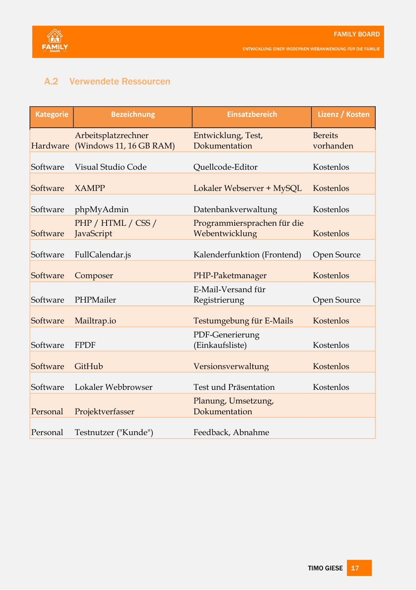

## A.3 GANTT-Diagramm

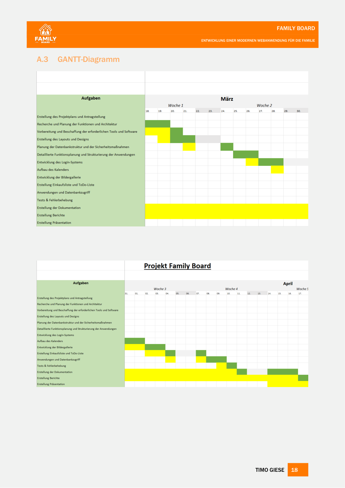

## A.4 Use-Case-Diagramm

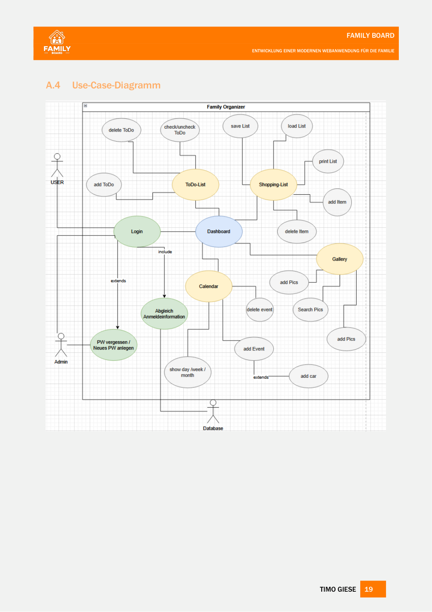

## A.5 Skizze Startseite

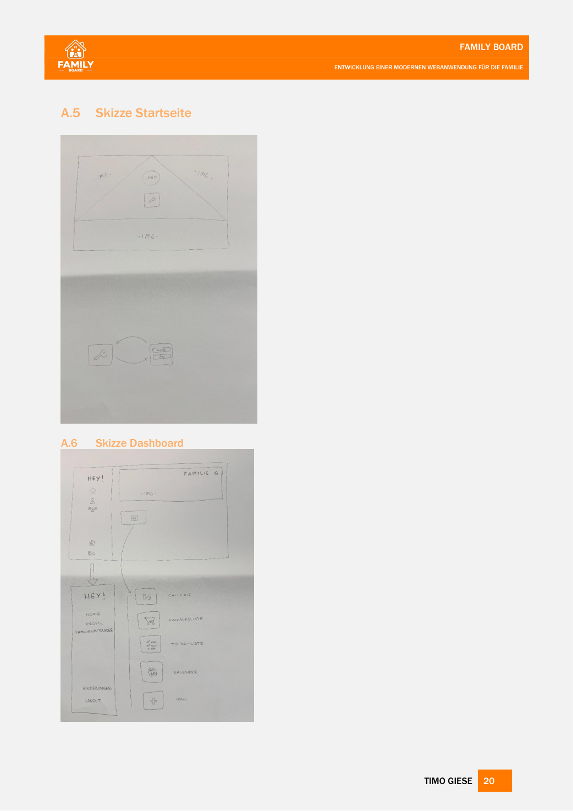

## A.6 Skizze Dashboard

## A.7 Skizzen Apps

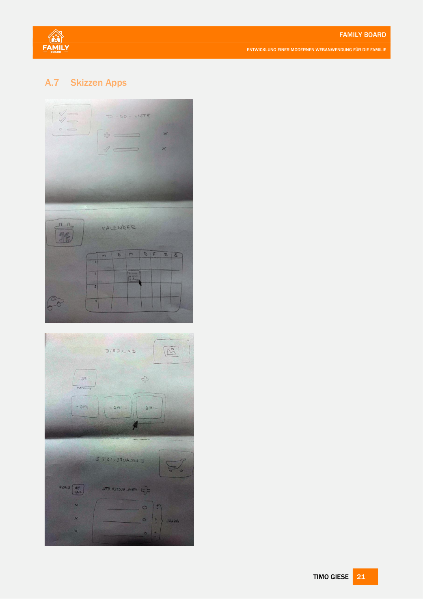

## A.8 ER-Diagramm

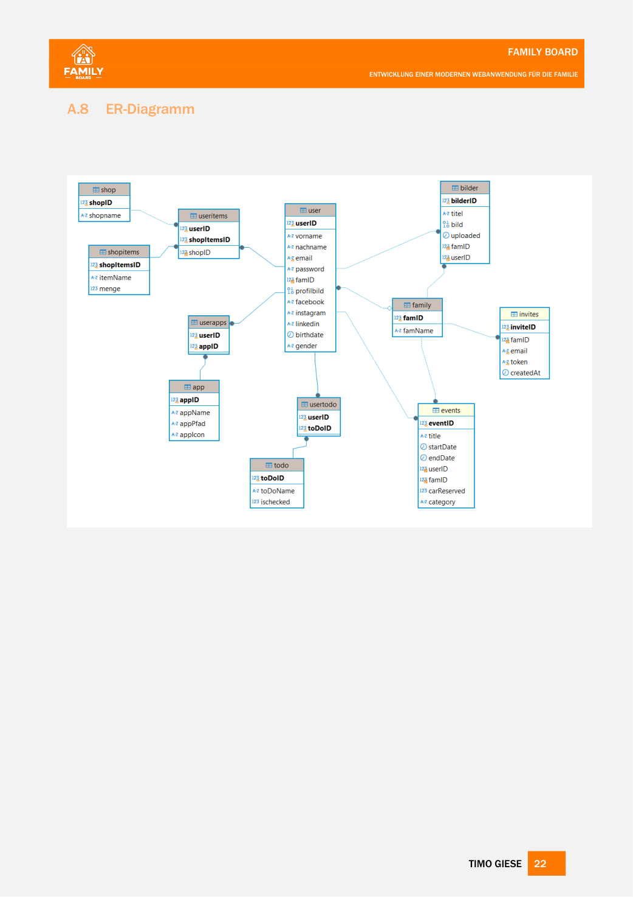

## A.9 JavaScript: Dynamisches Einblenden von Elementen

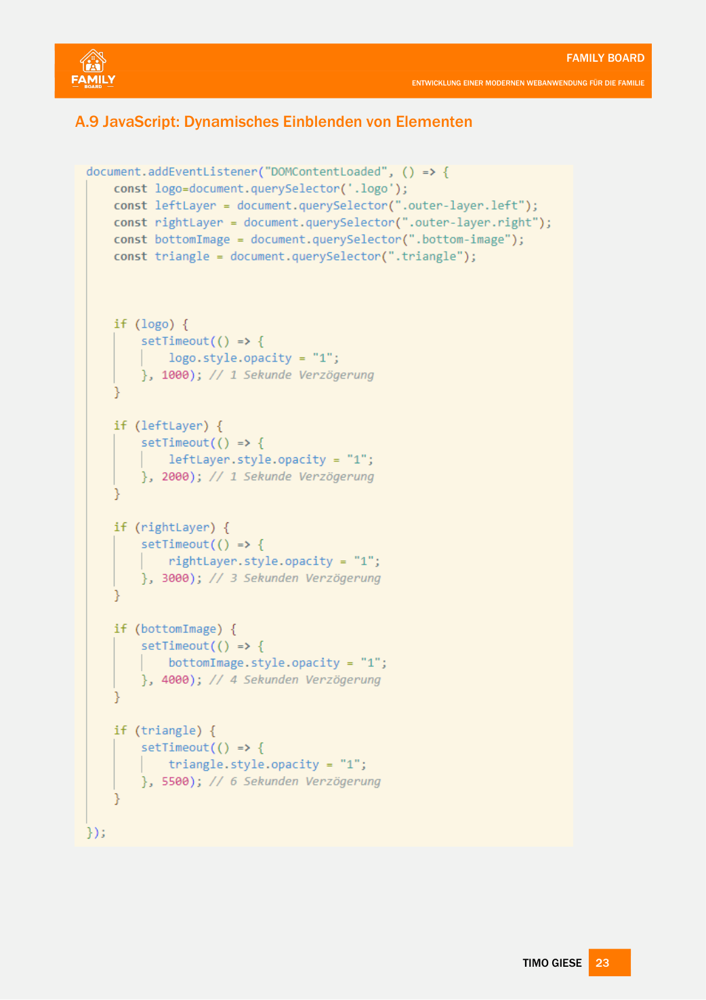

## A.10 JavaScript: Dynamische App-Verwaltung

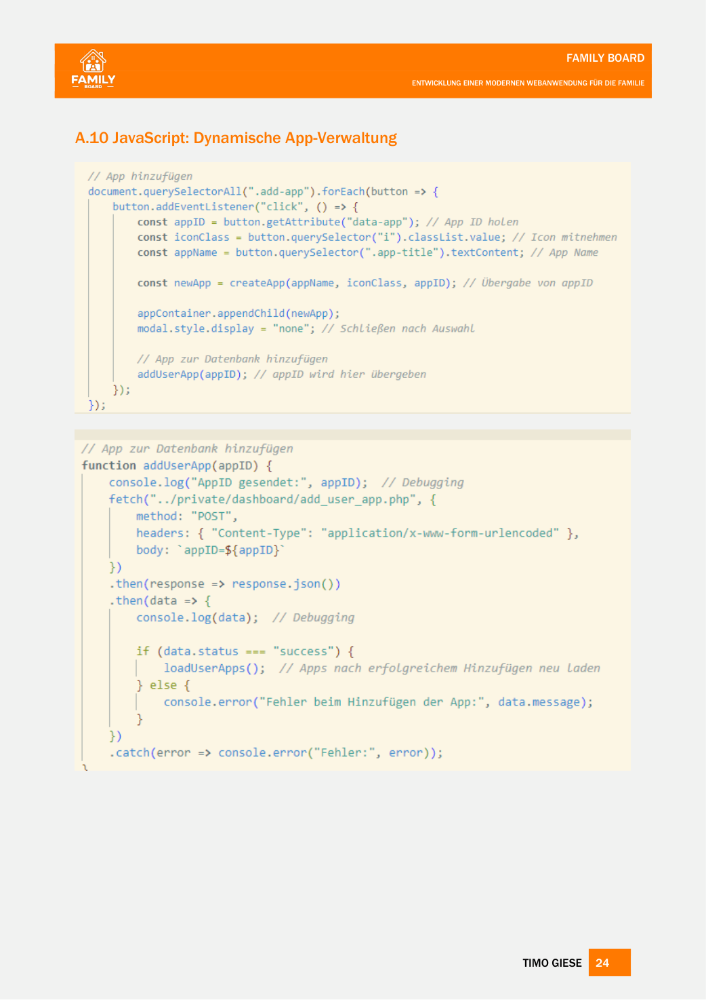

## A.11 JavaScript: Dynamische App-Verwaltung

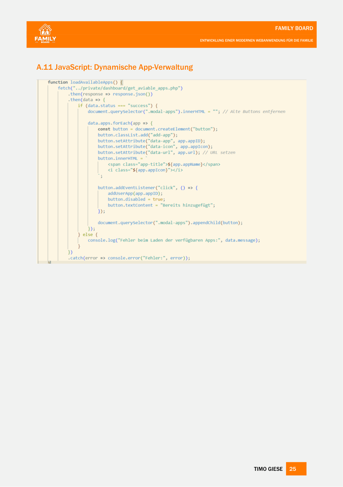

## A.12 JavaScript: Dynamische App-Verwaltung

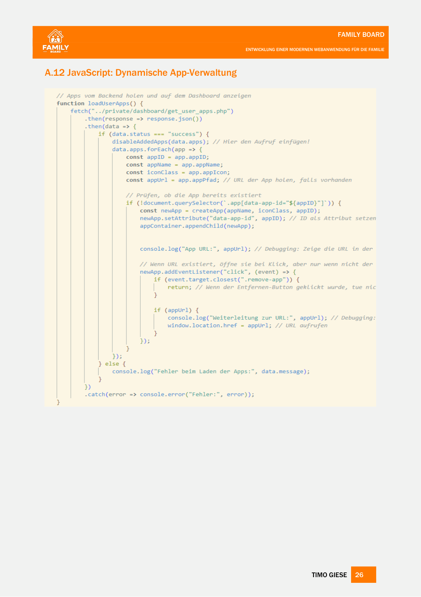

## A.13 Termin erstellen

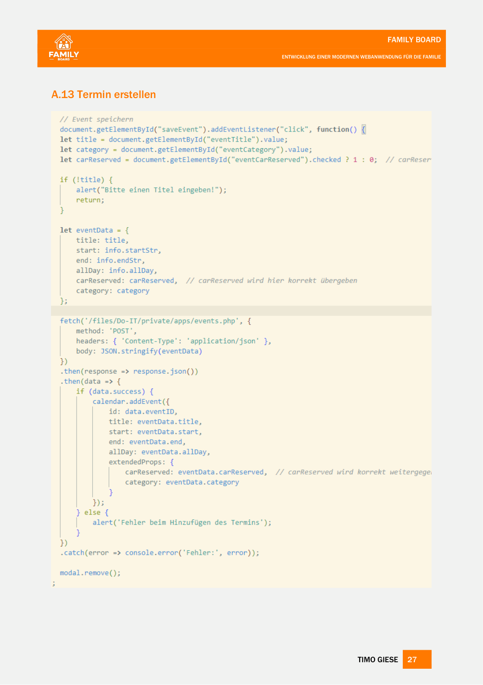

## A.13 PDF-Erstellung

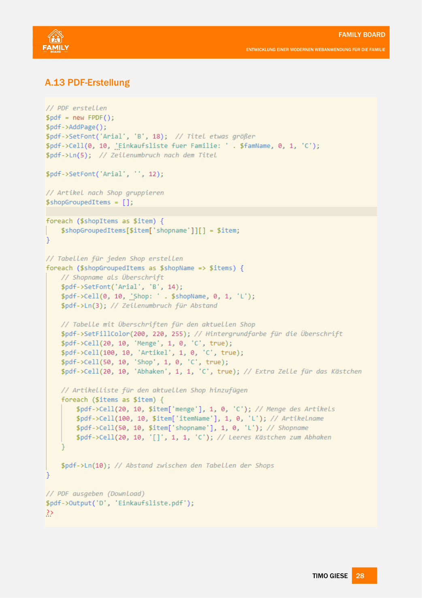

## A.14 Erstellung der ToDoListe

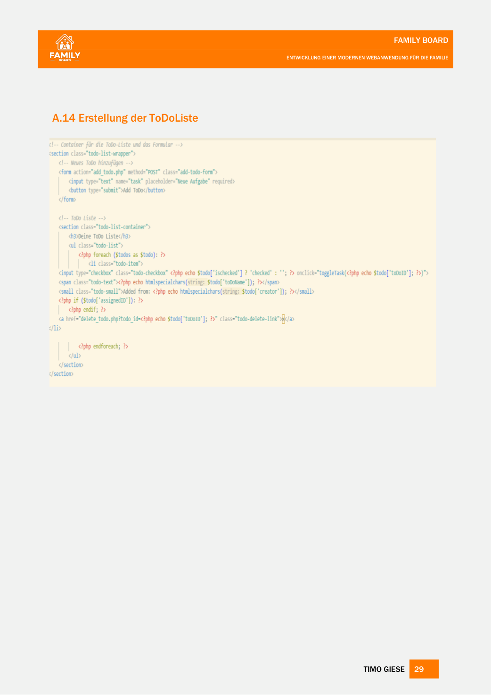
